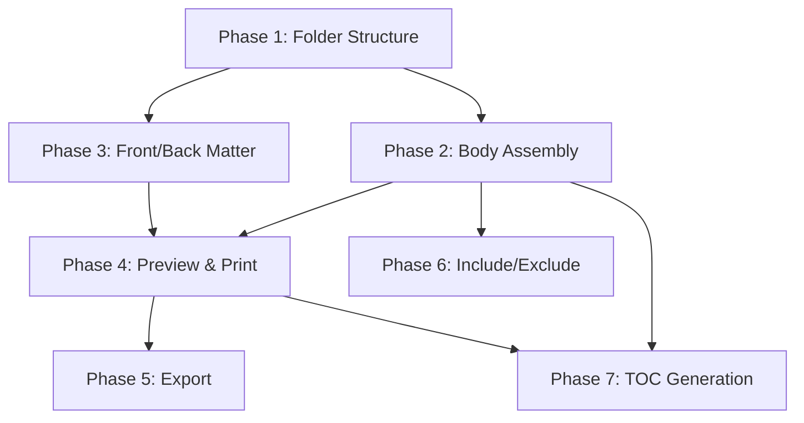

# Implementation Plan: Manuscript Assembly

**Branch**: `029-manuscript-assembly` | **Date**: 2026-01-10 | **Spec**: [spec.md](spec.md)
**Input**: Feature specification from `/specs/029-manuscript-assembly/spec.md`

## Summary

The Manuscript Assembly feature provides a unified view of complete works across all project types (General Purpose, Poetry, Fiction, Drama). The Manuscript folder contains three subfolders: Front Matter, Body, and Back Matter. The Body assembles content from source folders (Poems, Scenes, Scripts, Sections) based on project type. The feature includes preview, print, export to multiple formats, and automatic Table of Contents generation.

## Technical Context

**Language/Version**: Swift 5.9+  
**Primary Dependencies**: SwiftUI, SwiftData, UIKit (for printing/PDF)  
**Storage**: SwiftData with CloudKit sync  
**Testing**: XCTest  
**Target Platform**: iOS 17+, macOS 14+ (Catalyst)  
**Project Type**: Mobile/Tablet app with Mac Catalyst  
**Performance Goals**: Smooth scrolling for manuscripts up to 100,000 words, preview generation < 3 seconds  
**Constraints**: Memory efficient for large documents, offline-capable, must respect page setup settings  
**Scale/Scope**: Single user, manuscripts up to novel-length (~100k words, ~400 pages)

## Constitution Check

*GATE: Must pass before Phase 0 research. Re-check after Phase 1 design.*

| Principle | Status | Evidence/Notes |
|-----------|--------|----------------|
| **I. Code Quality** | ✅ PASS | Will follow existing patterns (FolderCapabilityService, ProjectTemplateService), full localization planned |
| **II. Testing Standards** | ✅ PASS | Unit tests for assembly logic, integration tests for export, UI tests for navigation |
| **III. User Experience Consistency** | ✅ PASS | Follows existing folder/file navigation patterns, consistent with print/export elsewhere |
| **IV. Performance Requirements** | ✅ PASS | Lazy loading planned, pagination reuses Feature 010 |
| **Additional: Dependencies** | ✅ PASS | No new external dependencies |
| **Additional: Security** | ✅ PASS | No sensitive data handling beyond existing patterns |

**Gate Status**: PASSED - Proceed to Phase 0

## Project Structure

### Documentation (this feature)

```
specs/029-manuscript-assembly/
├── spec.md              # Feature specification
├── plan.md              # This file
├── implementation-plan.md # Detailed phase breakdown
├── research.md          # Phase 0 output
├── data-model.md        # Phase 1 output
├── quickstart.md        # Phase 1 output
└── contracts/           # Phase 1 output (internal Swift protocols)
```

### Source Code (repository root)

```
WrtingShedPro/Writing Shed Pro/
├── Models/
│   ├── ManuscriptSection.swift      # NEW: Section container for assembly
│   └── TOCEntry.swift               # NEW: Table of contents entry
├── Services/
│   ├── ManuscriptAssemblyService.swift  # NEW: Content assembly logic
│   ├── TOCGeneratorService.swift        # NEW: TOC generation
│   ├── ManuscriptExportService.swift    # NEW: Export to PDF/RTF/Word
│   ├── ProjectTemplateService.swift     # MODIFY: Add subfolders
│   └── FolderCapabilityService.swift    # MODIFY: New folder capabilities
├── Views/
│   ├── Manuscript/                      # NEW: Manuscript views folder
│   │   ├── ManuscriptBodyView.swift
│   │   ├── ManuscriptPreviewView.swift
│   │   ├── ManuscriptExportSheet.swift
│   │   ├── ManuscriptSettingsView.swift
│   │   ├── TOCView.swift
│   │   └── TOCSettingsSheet.swift
│   └── FolderListView.swift             # MODIFY: Navigation handling
└── Resources/
    └── en.lproj/Localizable.strings     # MODIFY: Add localization

WrtingShedPro/WritingShedProTests/
├── ManuscriptAssemblyServiceTests.swift  # NEW
├── TOCGeneratorServiceTests.swift        # NEW
├── ManuscriptExportServiceTests.swift    # NEW
└── ProjectTemplateServiceTests.swift     # MODIFY: Add subfolder tests
```

**Structure Decision**: iOS/macOS mobile app structure. New files organized under existing Models/, Services/, Views/ hierarchy. Manuscript-specific views grouped in Views/Manuscript/ subfolder.

## Complexity Tracking

*No constitution violations - section not required*

---

## Phase Dependencies



## Risk Register

| Risk | Likelihood | Impact | Mitigation |
|------|------------|--------|------------|
| Large manuscript performance | Medium | High | Lazy loading, pagination, background assembly |
| Complex hierarchy assembly | Low | Medium | Comprehensive unit tests per project type |
| Export format compatibility | Medium | Medium | Test exports on multiple platforms |
| Migration of existing projects | Low | High | Non-destructive migration with backup |
| TOC page number accuracy | Medium | Medium | Page number resolution during final pagination pass |

## Next Steps

1. **Phase 0**: Generate research.md - Investigate existing pagination/print services for reuse
2. **Phase 1**: Generate data-model.md and contracts - Define ManuscriptSection, TOCEntry models
3. **Implementation**: Follow phases in implementation-plan.md
